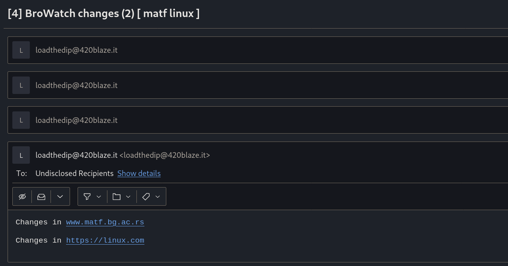

# Browatch

BroWatch is a shell script that watches static content for changes. The changed are packed and sent to the email given by the variable `EMAIL` or by running the script ./main.sh [EMAIL] with the commandline argument. Perfect for cron jobs.

The script uses the SMTP server package `msmtp` to send emails. It is up to the user to define the server which will be used to transfer the email.

## Usage

The urls to be tracked are defined in the file sites.sh in the format `ALIAS URL`. Check out the file for some examples.
